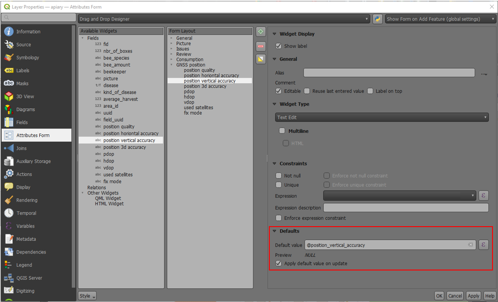
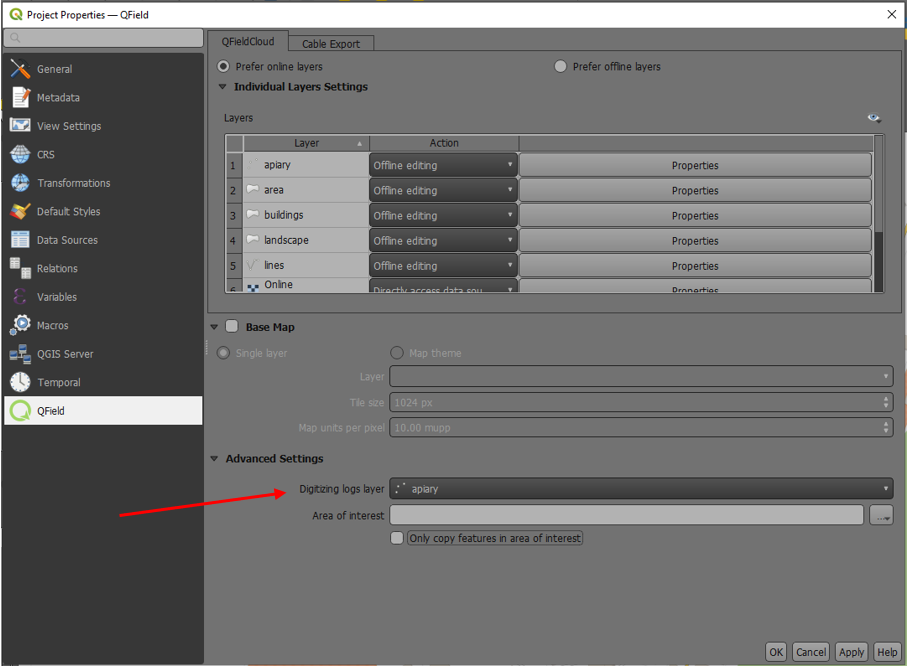

QField can make use of the internal GNSS (Global Navigation Satellite
System, like GPS, GLONASS, Galileo or Beidou). QField can also connect
to external antennas through bluetooth and directly integrate their NMEA
stream.

# Quality indication

## Additional variables {#gnss_variables}

You can get access to positioning information through additional
expression variables. These will only be available when positioning is
enabled.

These variables are commonly used as default values for fields to keep
track of the quality of individual measured points.

-   [\@position_source_name]{.title-ref}
    -   The name of the device that gave location information as
        reported by the sensor. To differenciate between internal and
        external sensor. If the position is manually set, and the
        position is not snapped to the cursor, the source name is
        \"manual\". **In case the cursor is not snapped to the position,
        all other variables will be null, if you need this, use the
        \`\`gnss\_\`\` variables instead**.
-   [\@position_quality_description]{.title-ref}
    -   A human readable and translated string for the quality as
        reported by the sensor. E.g. \"Fixed RTK\". It is only available
        when the crosshair is snapped to the sensor.
    -   E
    -   IE
-   [\@position_coordinate]{.title-ref}
    -   A point with the coordinate in WGS84. Lon, Lat, Altitude as
        delivered by the sensor. It is only available when the crosshair
        is snapped to the sensor.
    -   [x(\@position_coordinate)]{.title-ref}
    -   IE
-   [\@position_horizontal_accuracy]{.title-ref}
    -   The horizontal accuracy of the coordinate (in meters) as
        reported by the sensor. It is only available when the crosshair
        is snapped to the sensor.
    -   IE
-   [\@position_timestamp]{.title-ref}
    -   The timestamp of the position in UTC as reported by the sensor.
        It is only available when the crosshair is snapped to the
        sensor.
    -   IE
-   [\@position_direction]{.title-ref}
    -   The direction of movement in degrees from true north as reported
        by the sensor. It is only available when the crosshair is
        snapped to the sensor.
    -   IE
-   [\@position_ground_speed]{.title-ref}
    -   Groundspeed (in m/s) as reported by the sensor. It is only
        available when the crosshair is snapped to the sensor.
    -   IE
-   [\@position_magnetic_variation]{.title-ref}
    -   The angle between the horizontal component of the magnetic field
        and true north, in degrees as reported by the sensor. Also known
        as magnetic declination. A positive value indicates a clockwise
        direction from true north and a negative value indicates a
        counter-clockwise direction. It is only available when the
        crosshair is snapped to the sensor.
    -   IE
-   [\@position_vertical_accuracy]{.title-ref}
    -   The vertical accuracy of the coordinate (in meters) as reported
        by the sensor. It is only available when the crosshair is
        snapped to the sensor.
    -   IE
-   [\@position_3d_accuracy]{.title-ref}
    -   The 3 dimensional accuracy of the coordinate (in meters), 3D-RMS
        as reported by the sensor. It is only available when the
        crosshair is snapped to the sensor.
    -   IE
-   [\@position_vertical_speed]{.title-ref}
    -   The vertical speed (in m/s) as reported by the sensor. It is
        only available when the crosshair is snapped to the sensor.
    -   IE
-   [\@position_pdop]{.title-ref}
    -   Position dilution of precision as reported by the sensor. It is
        only available when the crosshair is snapped to the sensor.
    -   E
-   [\@position_hdop]{.title-ref}
    -   Horizontal dilution of precision as reported by the sensor. It
        is only available when the crosshair is snapped to the sensor.
    -   E
-   [\@position_vdop]{.title-ref}
    -   Vertical dilution of precision as reported by the sensor. It is
        only available when the crosshair is snapped to the sensor.
    -   E
-   [\@position_number_of_used_satellites]{.title-ref}
    -   Number of satellites as reported by the sensor. It is only
        available when the crosshair is snapped to the sensor.
    -   E
-   [\@position_used_satellites]{.title-ref}
    -   A list of satellites in use (pri) as reported by the sensor. It
        is only available when the crosshair is snapped to the sensor.
    -   [array_count(\@position_used_satellites)]{.title-ref}
    -   E
-   [\@position_fix_status_description]{.title-ref}
    -   The GPS Fix Status \"NoData\", \"NoFix\", \"Fix2D\" or \"Fix3D\"
        as reported by the sensor. It is only available when the
        crosshair is snapped to the sensor.
    -   E
-   [\@position_fix_mode]{.title-ref}
    -   Fix mode (where \'M\' = Manual, forced to operate in 2D or 3D or
        \'A\' = Automatic, 3D/2D) as reported by the sensor. It is only
        available when the crosshair is snapped to the sensor.
    -   E

All \@position\_\* variables have a corresponding \@gnss\_\* variable.
The gnss variables always report the gnss sensor values, even when the
crosshair is not snapped.

Examples:

:   -   when the crosshair is snapped to the sensor
        -   [\@gnss_horizontal_accuracy]{.title-ref} \--\> The
            horizontal accuracy of the coordinate (in meters) as
            reported by the sensor.
        -   [\@position_horizontal_accuracy]{.title-ref} \--\> The
            horizontal accuracy of the coordinate (in meters) as
            reported by the sensor.
        -   [\@position_source_name]{.title-ref} \--\> sensor name.
    -   when the crosshair is manually moved
        -   [\@gnss_horizontal_accuracy]{.title-ref} \--\> The
            horizontal accuracy of the coordinate (in meters) as
            reported by the sensor.
        -   [\@position_horizontal_accuracy]{.title-ref} \--\> The value
            is [NULL]{.title-ref}.
        -   [\@position_source_name]{.title-ref} \--\> The value is
            [manual]{.title-ref}.

I: Internal position source E: External (NMEA) position source

## Vertex log

It is possible to setup a log layer of the collected vertices. This
allows to keep track of meta data for each vertex like GNSS quality
attributes and more. To set this up, a point layer can be added to the
project and attributes configured to store this information.

{width="600px"}

Then the user assigns the role \"digitizing logger\" on a point layer.

Go to QFieldSync \--\> project Properties

{width="600px"}

The layer fields must have default value with GNSS variables.

## Accuracy requirement

A minimum desired accuracy for measurements can be defined. The quality
will be reported in three classes, bad (red), ok (yellow) and excellent
(green). These colors will show up as a dot on top of the GNSS button.

The thresholds can be defined in the positioning settings.

If the [Enable accuracy requirement]{.title-ref} setting is activated, a
user will not be able to collect new measurements with the cursor
snapped to the position with an accuracy value which is bad (red).

# Altitude

## Antenna height compensation

The height of the antenna pole in use can be defined in the settings.
Any measured altitude will be corrected by this value.

## Altitude correction / vertical grid shift

Altitude values can be corrected with vertical grid shift files to
calculate orthometric height

Vertical grid shift files have to be made available to QField by putting
them into the QField base folder ([\<external
storage>/QField/proj]{.title-ref}).

If you are using altitude correction and an external bluetooth connected
antenna consider turning [Use orthometric altitude from
device]{.title-ref} off.
