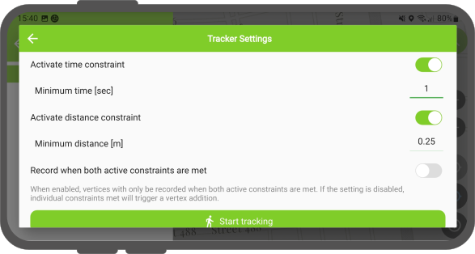
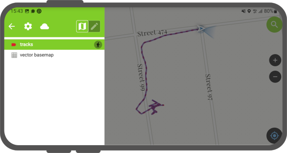
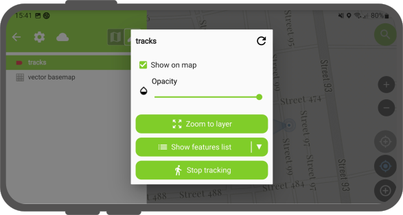

# Tracking

QField allows you to create points, lines, and polygons from tracking your position.

## Activate tracking

:material-tablet-android:{ .device-icon } Fieldwork

To activate tracking, you must first make sure the positioning is active. Then,
open the side dashboard, long-press on a legend layer within which you want to
save your tracks to, and select the *Setup tracking* button to configure
the tracking session.

!

Two constraints are available to limit the number of vertices recorded
during tracing:
- A minimum time interval; and
- A minimum distance.

!

Once you have finished configuring your tracing session, hit the *Start tracking*
button to begin recording. At this stage, a feature form will appear, which allows
you to define the attributes of the feature(s) that will be created while QField
tracks your position.

For line and polygon layers, a single feature - its geometry formed of vertices
from the recorded positions - will be create per tracking session.  For point
layers, a feature will be created for each recorded position, with attribute
values entered in the form remembered across features.

!!! note
    QField will skip the feature form step if the layer is configured to hide all attributes. This can streamline the process of starting tracking sessions.

## Tracking underway

Once a tracking session has been setup, a badge will appear in the side dashboard
legend next to the layer(s) against which tracking is being recorded.

!

The feature(s) created by the tracking session is/are saved on every vertex recorded.
A rubberband line overlayed onto the map is attached to each tracking session,
allowing you to glance at what has been recorded.

If the layer linked to a tracking session supports the M dimension, QField will store
the time passed since the first vertex recorded in each vertex's M value.

!!! note
    You can simultanously record multiple trackings sessions across several layers.

!!! note
    While the tracking session is active the layer is still editable, but the tracked feature can't be edited or deleted until the tracking session is stopped over the legend again.

## Terminate tracking

To terminate tracking, simply open the side dashboard. From there, long-press
on a legend layer linked to an active tracking session and select the
*Stop tracking* button.

!
